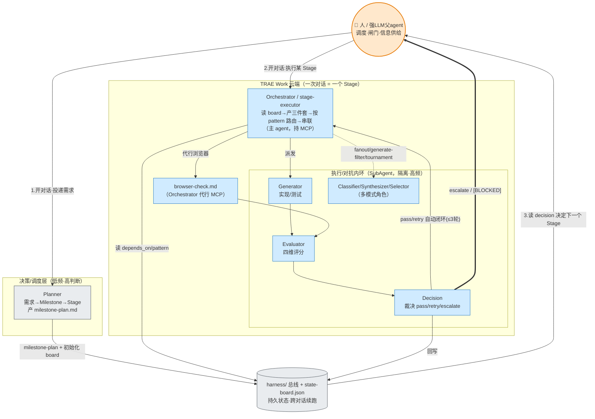

# Trae Harness Advisor

> Harness Engineering 在 TRAE Work 上的最佳实践——Advisor → Planner → Orchestrator → Generator/Evaluator/Decision 的 Milestone/Stage/Task 多智能体对抗架构（v4.5，含 6 种编排模式）

---

## 项目结构

```
.
├── README.md                                          # 本文件
├── trae-harness-advisor/                              # Skill 目录（可打包安装）
│   ├── SKILL.md                                       # Skill 主文件（英文版）
│   ├── SKILL.zh.md                                    # Skill 主文件（中文版）
│   ├── references/                                    # 渐进式披露参考
│   │   ├── harness-methodology.md                     # 方法论浓缩参考
│   │   └── deliverable-specs.md                       # 文件生成规格
│   ├── resources/                                     # Skill 运行时引用
│   │   └── harness-engineering-on-trae-work.md        # 方法论与架构完整文档（v4.5）
│   └── templates/                                     # 可复用模板（21 个：5 核心角色+stage-executor+4 骨架+多模式包 3 角色+4 playbook）
│       ├── planner-skill-template.md                  # Planner 角色 Skill 模板
│       ├── generator-skill-template.md                # Generator 角色 Skill 模板（含路径白名单）
│       ├── evaluator-skill-template.md                # Evaluator 角色 Skill 模板（业务质量评分）
│       ├── decision-skill-template.md                 # Decision 独立裁决者 Skill 模板
│       ├── stage-executor-skill-template.md           # Orchestrator 运行时 playbook Skill 模板
│       ├── spec.skeleton.md                           # Stage 规格骨架
│       ├── tasks.skeleton.md                          # Stage 任务骨架（G/E/D 顺序步骤）
│       ├── checklist.skeleton.md                      # 完成性 gate 骨架
│       ├── stage-contract.skeleton.md                 # Stage Contract 骨架
│       ├── generator-agent-template.md                # Generator Agent 配置模板（可选，未来兼容）
│       ├── evaluator-agent-template.md                # Evaluator Agent 配置模板（可选，未来兼容）
│       ├── decision-agent-template.md                 # Decision Agent 配置模板（可选，未来兼容）
│       ├── project-rules-template.md                  # RULE.md 模板（项目根目录，钩子规则加载）
│       └── eval-report-template.md                    # 业务质量评估报告模板
├── conversation-context-and-design-decisions.md       # 会话上下文与设计决策记录
│
│   # ↓↓↓ 以下为「自检 PoC 实例化环境」——由模板实例化，供真机 TRAE Work 跑 harness-selftest ↓↓↓
├── .trae/skills/                                      # 已实例化 12 个 Skill：5 核心 + 多模式包（3 角色+4 playbook）
│   ├── planner-role/SKILL.md
│   ├── generator-role/SKILL.md
│   ├── evaluator-role/SKILL.md                        # 业务质量四维评分（不含裁决）
│   ├── decision-role/SKILL.md                         # 独立中立裁决者（独立 SubAgent）
│   └── stage-executor/SKILL.md                        # Orchestrator 运行时 playbook（只串联）
├── RULE.md                                            # 项目规范（钩子规则加载目标）
├── harness/                                           # 持久真值 + 消息总线
│   ├── templates/{spec,tasks,checklist,stage-contract}.skeleton.md
│   ├── state-board.json                               # 已 seed: harness-selftest/probe
│   └── milestones/harness-selftest/milestone-plan.md  # 可直接运行的自检计划（AP1–AP18）
├── poc/                                               # 平台能力自检 PoC（人类可读测试套件）
│   └── harness-selftest/
│       ├── README.md                                  # 如何运行与判读
│       ├── test-prompt.md                             # ★ 复制粘贴到 TRAE Work 的测试提示词
│       └── expected-outcome.md                        # AP1–AP18 判读表 + 结果记录
├── archive/                                           # 过程档案
│   ├── harness-engineering-on-trae-work-plan.md       # v1.0 编写计划
│   └── supplement-and-alignment-plan.md               # v2.0 补充对齐计划
└── docs/                                              # 外部文档
    └── harness-engineering-on-trae-work/              # HTML 报告（人类可读）
```

> 说明：`trae-harness-advisor/` 是**可打包安装的 Skill 本体**；而 `.trae/skills/`、`RULE.md`、`harness/` 是**为自检 PoC 实例化的运行环境**（相当于对本仓库跑了一遍 advisor 的产物），让你无需先生成即可直接在真机验证平台能力。

## Skill 是什么

`trae-harness-advisor` 是一个 TRAE Work 平台上的 Harness Engineering 专家技能。它通过结构化问题引导用户理清项目上下文和定制需求，然后一键生成完整的 PGE+D（Planner-Generator-Evaluator-Decision）多智能体对抗架构配置。

**核心设计思想**：在 TRAE Work 免费版的能力范围内，通过组合 SPEC + Skills + RULE.md 钩子规则 + harness/ 持久消息总线，拼装出一个模拟 Claude Code 内置 Orchestrator 的编排系统。方法论效果可以追齐 Claude Code 的 Harness 编排——角色分离、上下文隔离、对抗验证——但调度仍需人类触发（半自动）。

**v4.0 三级层次与角色分工**：

| 层级 | 角色 | 职责 | 输出 |
|------|------|------|------|
| L0 | **Advisor Skill** | 一次性初始化 Harness 基础设施 | 5 个核心 Skill（+可选 7 个多模式）+ RULE.md + 4 个 skeleton + state-board.json + 钩子规则文本 |
| L1 | **Planner** | 将需求规划为 Milestone，并拆成可独立验收的 Stage | milestone-plan.md + 初始化 state-board.json |
| L2 | **Orchestrator** | 每个 Stage 加载 stage-executor，运行 /spec 产三件套（留 .trae/specs）并**串联**对抗（自己不兼任角色） | 交付物 contract/gen/eval/decision 写 harness/ + 据裁决决定下一步（retry 改 tasks.md+重派）+ 状态回写 |
| 执行层 | **Generator/Evaluator/Decision**（各为独立 SubAgent） | 顺序模拟对抗：实现、业务质量评分、**独立中立裁决** | gen.md + eval.md + decision.md |

**TRAE Work 能力映射**：

| 配置项 | 云端支持？ | 处理方式 |
|--------|-----------|--------------|
| `.trae/skills/` | 是，自动按需加载 | 角色 Skill + stage-executor 的唯一云端自动加载通道 |
| `.trae/rules/` | 否 | 不使用；改为 RULE.md + 钩子规则 |
| `.trae/agents/` | 否（当前） | 保留为可选，角色行为内嵌到 Skill 中 |
| `.trae/specs/` | 原生临时区 | 仅作 /spec scratch，gitignored，不作为消息总线 |
| `harness/` | 普通项目目录 | 持久真值与跨 session 消息总线 |

**生成的文件**（11 个核心文件 + 1 段钩子规则文本；可选 3 个 Agent 配置、可选 7 个多模式 Skill）：

- 5 个核心 Skill：Planner、Generator、Evaluator（业务质量评分）、**Decision（独立裁决者）**、stage-executor
- 可选 7 个多模式 Skill（`generate_patterns=true` 时）：Classifier/Synthesizer/Selector 3 角色 + pattern-classify/fanout/generate-filter/tournament 4 个 playbook
- RULE.md（项目根目录，TRAE Work 云端通过钩子规则加载）
- 4 个结构骨架：spec.skeleton.md、tasks.skeleton.md、checklist.skeleton.md、stage-contract.skeleton.md
- state-board.json v2（动态状态机唯一真值）
- 钩子规则文本（用户复制到「设置 > 规则」的一次性配置）
- 可选 3 个 Agent 配置文件（供未来兼容）

**关键架构要点**：

- 严格三级层次：Milestone > Stage > Task。
- SPEC 三件套在 Stage 层由 Orchestrator 运行时创建于 `.trae/specs/`（过程脚手架，不入 harness/git）；只有交付物 contract/gen/eval/decision + board 持久化到 `harness/`。
- `harness/` 是唯一持久真值与消息总线；`.trae/specs/` 是原生三件套 scratch（对话结束即弃）。
- 验收标准放 `contract.md`（不在 spec.md），故三件套不持久化不影响验收。
- 两类验收分工：checklist.md 是底层完成性 gate；Evaluator 是业务质量四维评估。
- 验收标准来源：根在 milestone-plan（Planner 要点），Orchestrator 誊写不发明。每 Stage 标 `contract_mode`：`planned`（默认，直接写 contract.md）或 `codraft`（可选，Generator 草稿→Evaluator 敲定标准→再对抗）。
- 对抗流程为顺序模拟，最多 3 轮返工，超限 escalate 给人类。
- milestone-plan.md 是静态定义；state-board.json v2 是动态状态机唯一真值（最小更新，git 合并友好）。
- 并发 = 人类开多个独立对话推进；depends_on 是人工投递前的冲突规避依据，非自动调度。
- 约束强度：路径白名单/RULE.md 钩子/playbook 均为提示词级（best-effort），非沙箱强制，需 CI/评审兜底。

**与 Claude Code 的差异**：见主文档 1.4 节和 3.x 节。简言之：Claude Code 是“全自动挡汽车”，我们是在“手动挡汽车”上安装了“辅助驾驶系统”。

## 如何使用（面向用户）

### 三步上手

1. **初始化（一次）**：在项目里调用 `trae-harness-advisor` Skill，回答几轮问答（技术栈、规模、TDD/严格度、是否要多模式包等）。它会生成角色 Skill、`stage-executor` playbook、`RULE.md`、骨架模板和空 `state-board.json`。按提示把「钩子规则文本」复制到 TRAE Work「设置 > 规则」（让云端每次自动读 `RULE.md`）。
2. **规划（每个大目标一次）**：用生成的 `planner-role` 让 Planner 把需求拆成一个 **Milestone** + 若干可独立验收的 **Stage**，产出 `milestone-plan.md`（每个 Stage 带验收标准要点、`depends_on`、`contract_mode`、`pattern`），并初始化 board。
3. **执行（每个 Stage 一次对话）**：对 TRAE Work 说「执行 Stage / 开始阶段」触发 `stage-executor`。它自动：读 board 定位当前 Stage → 校验依赖 → 产三件套 → 按 `pattern` 路由编排 → 派发子代理对抗/比较 → 回写 board。产物落 `harness/`。

### 每个 Stage 选一种编排模式（`pattern` 字段）

Planner 在 `milestone-plan.md` 给每个 Stage 标 `pattern`（默认 `adversarial`）；`stage-executor` 据此路由到对应 playbook。**默认只有 `adversarial`+`loop` 可用；其余 4 种需在初始化问答第 5b 题开启「多模式包」（`generate_patterns=true`）后才生成对应 Skill。**

| pattern | 一句话用途 | 何时选 | 需要多模式包 |
|---------|-----------|--------|:---:|
| `adversarial`（默认） | 做一件事并保证质量：Generator 实现→Evaluator 评分→Decision 裁决→retry | 绝大多数开发/联调 Stage | 否（内置） |
| `loop` | 反复精炼直到客观标准达标（=retry 的泛化） | 有明确可机械检查的达标线（如覆盖率、Lint 零告警） | 否（内置） |
| `classify` | 先判类型再分流处理 | 输入类型多样、不同类型走不同流程（如 bug/需求/重构分流） | 是 |
| `fanout` | 拆成 N 个独立子任务并行、再汇总 | 可切分的独立工作（多模块、多文件），要并行加速 | 是 |
| `generate-filter` | 生成 N 个候选方案、选最优 | 方案不唯一、想择优（多种实现/命名/架构选型） | 是 |
| `tournament` | N 个候选两两淘汰选冠军 | 候选很多、需要更强区分度的择优 | 是 |

> 模式可**嵌套**：如某 Stage 用 `classify` 路由到不同分支，某个分支内部再用 `fanout`，`fanout` 的每个子任务内部又走 `adversarial`。原则不变：执行机只跑「频繁对抗/比较的内环」，跨 Stage 由你开新对话调度（或父 Agent 上下文够时一次跑多个 Stage）。

### 想先看它怎么跑？

本仓库已实例化一套自检环境（`.trae/skills/`+`RULE.md`+`harness/`），可直接在真机 TRAE Work 上跑 `poc/harness-selftest/`——用一条提示词端到端验证 AP1–AP18（含 6 种模式路由）。详见 `poc/harness-selftest/README.md`。

## 全自动 vs 半自动：6 种模式怎么模拟、人在哪里补位

我们对标 Claude Code Dynamic Workflows 的 6 种编排模式。Claude Code 靠**平台内置 Orchestrator 全自动**跑完；我们用 TRAE Work 免费版的原语（顺序/分支/并行/有界循环/自修改 tasks.md/持久 board）+ 独立 SubAgent + `harness/` 总线**半自动**模拟——**差距不在方法论，而在「跨 Stage 调度」和「上下文预算」这两处需要人补位**。

### 逐模式对比：自动到哪、差在哪

| 模式 | Claude Code（全自动） | 我们（半自动模拟） | 差在哪（人补位点） |
|------|----------------------|-------------------|-------------------|
| **adversarial**（PGE） | 内置引擎自动 G→E→D→retry | Orchestrator 在**一次对话内**自动驱动 G/E/D + 有界 retry（≤3 轮） | Stage 内**全自动**；仅 escalate 时人裁决 |
| **loop** | 自动迭代到达标 | Orchestrator 自动有界循环 + 客观检查 | Stage 内**全自动** |
| **classify** | 自动判类+路由 | Classifier 打标签 → Orchestrator 分支 | Stage 内自动；若分支通向重型新 Stage，跨 Stage 由人调度 |
| **fanout** | 自动并行+汇总 | 一条消息并行派 N 个 Generator → Synthesizer 归并 | N 小时自动；**N 大到超上下文预算**→人分批跨对话续跑 |
| **generate-filter** | 自动生成候选+选优 | 并行 N 候选 → Selector 选优 | 同上：候选多则人分批 |
| **tournament** | 自动多轮淘汰 | Selector 按 log2(N) 轮淘汰 | 轮次多、候选多→人驱动跨对话续跑 |

> 一句话：**在「一个 Stage / 一个上下文窗口」内，我们已是 LLM 驱动的动态编排（图灵完备底座已真机验证）**。与全自动的唯一差距是——① **跨 Stage 的调度**（开新对话、边界闸门）默认由人做（父 agent 上下文预算够时也能自动一次跑多个 Stage）；② **超大 fan-out/tournament** 受上下文预算限制需人分批；③ MCP 不下发 SubAgent，浏览器验证由 Orchestrator 代行。前两者是**预算问题**、第三者是**平台限制**，都不是方法论缺陷。

### 人算不算一个逻辑角色节点？——算，且是一等节点

在我们的拓扑里，**人是显式的逻辑节点**，承担 Claude Code 内置 Orchestrator 自动做、而 TRAE Work 免费版尚不能全自动的三件事：

1. **调度器（跨 Stage）**：读 board 决定下一个跑哪个 Stage、开哪次对话。（父 agent 上下文够时可代人自动化。）
2. **闸门/裁决复核**：Stage 边界读 `decision.md`；`pass`→放行，`retry`→触发下一轮，**`escalate`→人拍板**；并处理 Generator 抛出的 `[BLOCKED]`。
3. **信息供给**：提供 SubAgent 无法自取的东西——API Key、生产授权、方向性决策（对应 Generator「7 种必停」）。

### 哪些节点适合强 LLM 跑、哪些该丢给 TRAE Work 跑

设计原则：**把「高频、吃 token、按文档执行」的对抗内环丢给免费的 TRAE Work；把「低频、高判断、需全局」的调度判断留给强 LLM 或人。**

| 层 | 节点 | 谁跑得好 | 为什么 |
|----|------|---------|--------|
| **决策/调度层**（低频·高判断） | 人 / 可选强 LLM 父 agent | **人 + 强 LLM** | 跨 Stage 编排、escalate 拍板、战略拆分——量小但要全局判断，token 不敏感 |
| ↑ Planner | 战略拆分（Milestone→Stage） | **强 LLM / 人主导** | 需方法论 + 全局视野，一次性产出，值得用贵模型 |
| **编排层**（Stage 内控制流） | Orchestrator（=stage-executor） | **TRAE Work 主 agent** | 需图灵完备控制流 + **MCP**（浏览器代行）；只串联不兼任角色 |
| **执行/对抗层**（高频·按文档·吃 token） | Generator / Evaluator | **TRAE Work SubAgent** | 写码/跑测试/审查的频繁对抗内环——量大、重复、按文档执行，正是要卸载到免费平台的部分 |
| ↑ Decision | 中立裁决 | **TRAE Work SubAgent** | 必须与 G/E 上下文隔离才中立；escalate 上抛给人 |
| ↑ Classifier / Synthesizer / Selector | 打标签/归并/选优 | **TRAE Work SubAgent** | 机械比较类，轻量、可并行、按 playbook 执行 |

### 串联图：人 + 各角色如何接在一起



> 读图：实线=自动数据流；`==>` 粗线=**必须回到人**的上抛（escalate/BLOCKED）；`harness/ 总线`是所有角色唯一的通信媒介（角色间不直接对话，只读写总线文件），也是上下文吃紧时**分批续跑**的持久锚点。绿框内（Stage 内对抗）已全自动；人只在 ①开对话投递需求 ②按 Stage 开执行对话 ③读裁决决定下一步 三个点补位。

## 安装 Skill

将 `trae-harness-advisor/` 目录打包为 `.zip`，在 TRAE IDE 中通过 **设置 → 技能与命令 → 创建 → 导入外部技能** 上传即可。

或者直接复制到项目的 `.trae/skills/trae-harness-advisor/` 目录下。

## 给后续 Agent 的指引

如果你是一个被要求继续优化此 Skill 的 Agent，请按以下顺序阅读：

1. **`trae-harness-advisor/resources/harness-engineering-on-trae-work.md`** — Harness Engineering 在 TRAE Work 上的完整方法论（v4.5；先读第零部分核心概念定义，再读 4.1 stage-executor 与三件套骨架，多模式编排见 3.10）
2. **`conversation-context-and-design-decisions.md`** — 本项目起源、关键决策及理由（含 v4.0–v4.5 决策记录，决策 1→17 按时间线）
3. **`trae-harness-advisor/SKILL.zh.md`** — Skill 的工作流程与 I/O 契约
4. **`trae-harness-advisor/references/deliverable-specs.md`** — 文件生成详细规格（11 个核心文件 + 钩子规则文本 + 可选 Agent 配置 + 可选 7 个多模式 Skill，见 §11）
5. **`trae-harness-advisor/templates/`** — 21 个模板（5 核心角色+stage-executor+4 骨架+3 多模式角色+4 pattern playbook）
6. **`poc/harness-selftest/`** — 平台能力自检套件 + 已实例化的 `.trae/skills`/`RULE.md`/`harness/` 环境，真机验证 AP1–AP18 假设

**请勿回退**：
- 不要恢复旧层级命名；统一使用 Milestone / Stage / Task。
- 不要让 Planner 生成 Stage 三件套；它们必须由 Orchestrator 运行时创建。
- 不要把 checklist.md 与 Evaluator 混为一谈。
- 不要依赖 `.trae/specs/` 做持久状态或消息传递。

## 方法论来源

本项目基于以下业界 Harness Engineering 实践的调研和整合：

| 来源 | 核心贡献 |
|------|---------|
| Mitchell Hashimoto | 6 阶段 AI 采用框架，阶段 5 = “工程化 Harness” |
| OpenAI | 0 人类代码行、100 万行生成代码、Context Engineering + Architectural Constraints |
| Anthropic | Pattern A（Initializer + Coding Agent）和 Pattern B（Planner-Generator-Evaluator） |
| Martin Fowler | Feedforward vs Feedback、Computational vs Inferential |
| LangChain | Agent = Model + Harness |
| Claude Code | `.claude/agents/` 静态 Harness、Dynamic Workflows（6 种编排模式）、内置 Orchestrator |
